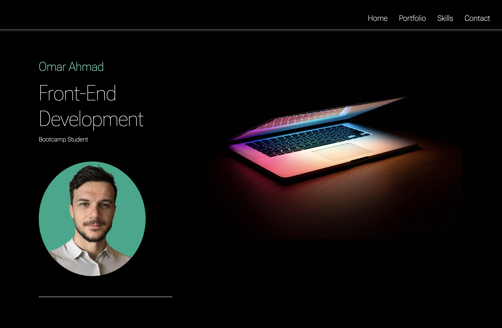

# Bootstrap Portfolio

## Table of contents

- [Objective](#Project-objective)
- [Project Brief](#Project-Brief)
- [Thought Process](#Thought-process)
- [Wireframe design](#Initial-wireframe-design)
- [License](#License)

## Deployed site

## Project objective

- The challenge is to create a personal portfolio page using Boostrap components and the skills we learned during module 3.

## Project Brief

Using the skill we learnt in week 3 we were asked to re-create our personal portfolio using Bootstrap components.

I decided to keep to my original design scheme as I liked the look and feel of this

I started off by inserting a Bootstrap Jumbotron and then slowly built ontop of this to re-create my portfolio.

My project includes all of the following:

- A navigation bar and menu
- Hero / Jumbotron section
- A grid section which displays my past projects and Interests
  - This will later be updated with other projects I build within the bootcamp
  - The grid section includes Bootstrap cards for each project/interest
- Skills section highlighting subjects we've covered so far as well as subjects we will be due to cover
  - I included a progress bar for each subject and gave my self a percentage indicator on how comfortable I feel I am on each subject.
- About section with a brief description of who I am and my hobbies and interests
- Contact form and information
- A footer section that includes social icons which have a box-shadow hover effect applied.

## Thought Process

I wanted to create a clean and simple layout with advanced functionality to navigate my site.

I want to incorporate unique design elements and a standout factor to attract potential future clients.

Following on from the previous portfolio challenge I have been able to incorporate a hamburger menu for smaller devices and improve functionality throughout my site.

In the last project I used images as icons to display social icons, this time I've incorporated icons via Font awesome and bootstrap layouts.

For the skills sections I incorporated a boostrap progress component to hightlight skills learned.
## Initial Wireframe Design

I re-created and updated my wireframe design using Procreate on Ipad Pro.

I did a mock up of how I wanted to structure the page to give a look and feel of the end result.

Check out my initial layout below

Screenshot 1:

Screenshot 2:

## License

Please refer to the LICENSE in the repo
